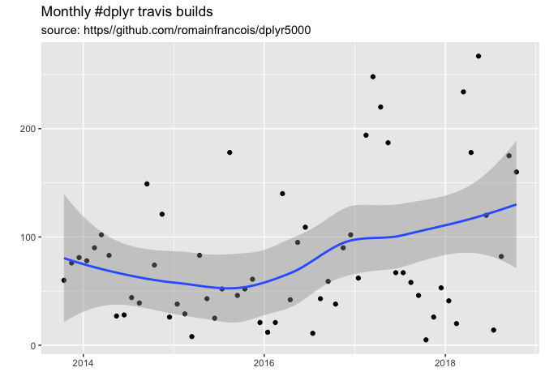

<!-- README.md is generated from README.Rmd. Please edit that file -->

# dplyr5000

The package contains a tibble with 5000 rows, one for each of the first
5000 travis builds of [dplyr](https://github.com/tidyverse/dplyr).

``` r
library(tidyverse)
#> ── Attaching packages ──────────────────────────────────────────────────────────────────────────────────── tidyverse 1.2.1 ──
#> ✔ ggplot2 3.0.0           ✔ purrr   0.2.5      
#> ✔ tibble  1.4.2.9005      ✔ dplyr   0.7.99.9000
#> ✔ tidyr   0.8.1.9000      ✔ stringr 1.3.1      
#> ✔ readr   1.1.1           ✔ forcats 0.3.0.9000
#> ── Conflicts ─────────────────────────────────────────────────────────────────────────────────────── tidyverse_conflicts() ──
#> ✖ dplyr::filter() masks stats::filter()
#> ✖ dplyr::lag()    masks stats::lag()
library(lubridate)
#> 
#> Attaching package: 'lubridate'
#> The following object is masked from 'package:base':
#> 
#>     date
# remotes::install_github("romainfrancois/dplyr5000")
library(dplyr5000)

dplyr5000 %>% 
  group_by(state) %>% 
  tally(sort = TRUE)
#> # A tibble: 4 x 2
#>   state        n
#>   <chr>    <int>
#> 1 passed    3133
#> 2 failed     952
#> 3 errored    767
#> 4 canceled   148

# monthly builds
dplyr5000 %>% 
  group_by(month = ymd(format(finished_at, "%Y-%m-15"))) %>% 
  tally() %>% 
  ggplot(aes(month, n)) + 
  geom_point() + 
  geom_smooth(method = loess, formula = y ~ x) + 
  labs(
    title = "Monthly #dplyr travis builds",
    subtitle = "source: https//github.com/romainfrancois/dplyr5000"
  ) + 
  xlab("") + ylab("")
```


